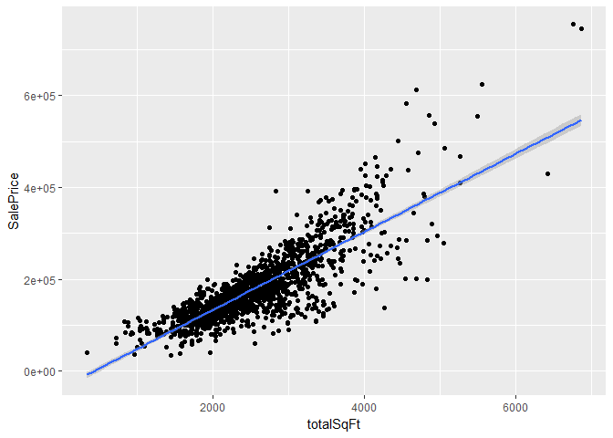
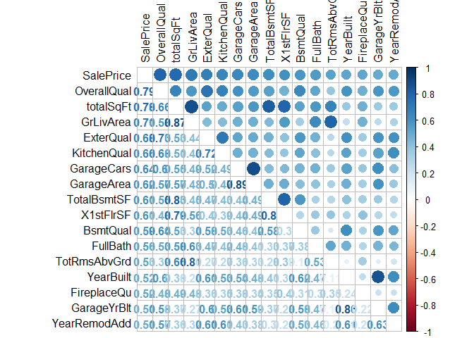
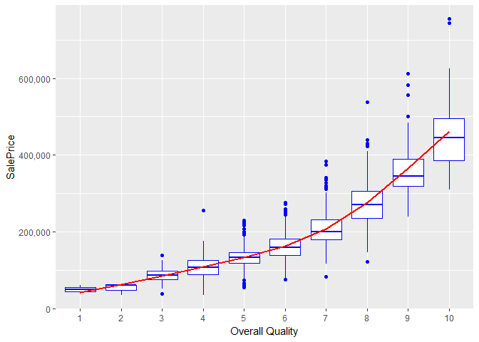
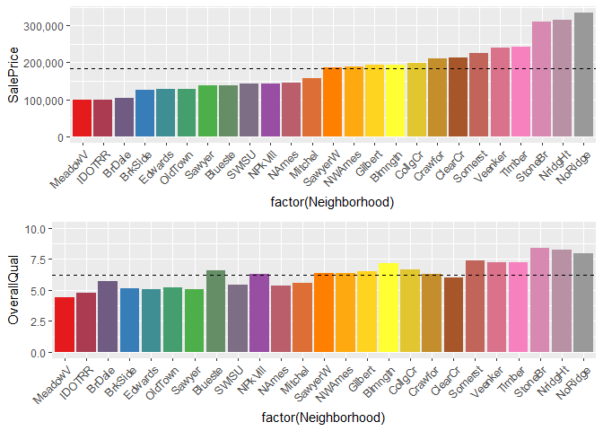
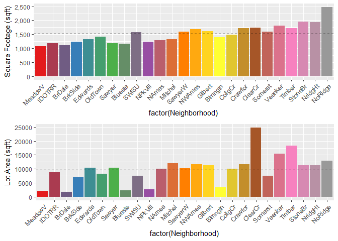
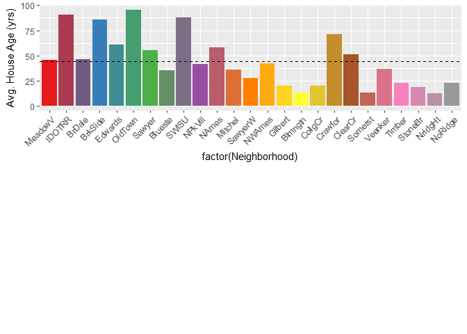

Housing Price Prediction Presentation
================
Jason Wilcox
Aug 6, 2018

Introduction
------------

Housing prices are always changing and anyone who has bought or sold a home knows that the true value can differ greatly depending on a large number of factors. Knowing which traits and qualities can add or detract from a home's value could help in not only determining the true value, but also aid potential buyers and sellers. Analyzing housing data can grant exceptional insight to the best way a seller could increase the value of the house they have put up for sale. Increasing square footage or the size of the garage may be easy ways for a seller to raise the value before the house does sell. Potential buyers can better understand the actual value of a house before they decide to purchase one and know if they are getting a good deal. Predicting the sales price of different homes is possible with the data set sourced from Kaggle (<https://www.kaggle.com/c/house-prices-advanced-regression-techniques>).

Data
----

The dataset comprises of 2919 houses having 80 variables (81 initially). These variables are:

     [1] "Id"            "MSSubClass"    "MSZoning"      "LotFrontage"  
     [5] "LotArea"       "Street"        "Alley"         "LotShape"     
     [9] "LandContour"   "LotConfig"     "LandSlope"     "Neighborhood" 
    [13] "Condition1"    "Condition2"    "BldgType"      "HouseStyle"   
    [17] "OverallQual"   "OverallCond"   "YearBuilt"     "YearRemodAdd" 
    [21] "RoofStyle"     "RoofMatl"      "Exterior1st"   "Exterior2nd"  
    [25] "MasVnrType"    "MasVnrArea"    "ExterQual"     "ExterCond"    
    [29] "Foundation"    "BsmtQual"      "BsmtCond"      "BsmtExposure" 
    [33] "BsmtFinType1"  "BsmtFinSF1"    "BsmtFinType2"  "BsmtFinSF2"   
    [37] "BsmtUnfSF"     "TotalBsmtSF"   "Heating"       "HeatingQC"    
    [41] "CentralAir"    "Electrical"    "X1stFlrSF"     "X2ndFlrSF"    
    [45] "LowQualFinSF"  "GrLivArea"     "BsmtFullBath"  "BsmtHalfBath" 
    [49] "FullBath"      "HalfBath"      "BedroomAbvGr"  "KitchenAbvGr" 
    [53] "KitchenQual"   "TotRmsAbvGrd"  "Functional"    "Fireplaces"   
    [57] "FireplaceQu"   "GarageType"    "GarageYrBlt"   "GarageFinish" 
    [61] "GarageCars"    "GarageArea"    "GarageQual"    "GarageCond"   
    [65] "PavedDrive"    "WoodDeckSF"    "OpenPorchSF"   "EnclosedPorch"
    [69] "X3SsnPorch"    "ScreenPorch"   "PoolArea"      "PoolQC"       
    [73] "Fence"         "MiscFeature"   "MiscVal"       "MoSold"       
    [77] "YrSold"        "SaleType"      "SaleCondition" "SalePrice"    
    [81] "totalSqFt"    

Most are pretty obvious, but some are less clear. Condition 1 and 2 represent the houses proximity to various conditions such as railroads, parks, arterial street, etc. OverallQual is a rating given to the house based on material and finish. BsmtExposure refers to walkout or garden level walls. GrLivArea is the above ground living area in sqft.Further information about the details of each variable can be found on the Kaggle website (<https://www.kaggle.com/c/house-prices-advanced-regression-techniques/data>). The data\_description.txt file gives a quick idea of what each variable represents and the possible levels if it is a factor variable.

Data Wrangling
--------------

Initially the raw test and train data were loaded as a CSV file and bound together to create a full dataset of 2919 observations. I then went systematically through the variables looking for missing values to replace and any other erroneous data points that needed to be addressed. Initially there were 15424 NA's among 37 variables (including the 1459 missing from SalePrice).

For many categories, it was simply easiest and best suited to just replace any NA's with the most common occuring value. This was done with MSZoning \[4\], Functional \[2\], Exterior1st and 2nd \[1, 1\], Electrical \[1\], KitchenQual \[1\], and SaleType \[1\]. Also very common was simply replacing NA with "None" or some default. This was done in MiscFeature \[2814\], Alley \[2721\], GarageYrBlt \[159\] (Na were converted to match HouseYrBlt since these houses appeared to have no garage or a garage built when the house was built), GarageType \[157\], GarageCond \[159\], GarageFinish \[159\], GarageQual \[159\], BsmtExposure \[82\], BsmtCond \[82\], BsmtQual \[81\], and MasVnrArea \[23\]. BsmtFinType 1 and 2 \[79, 80\], BsmtUnfSF, TotalBsmtSF, BsmtFullBath, and BsmtHallfBath \[1, 1, 2, 2\] were all replaced with 0's.

``` r
combined$MiscFeature <- factor(ifelse(is.na(combined$MiscFeature), "None", paste(combined$MiscFeature)), levels = c(levels(combined$MiscFeature), "None"))
```

Some values had ordinality naturally or needed to be assigned ordinality. NA's were also present and needed to be converted to "None". PoolQC \[2909\] and FireplaceQual \[1420\] already had some ordinality but I wanted to convert them from their system of ratings using letters (Fa = Fair, Gd = Good, etc) to that of numbers so I could treat it as numeric. I assigned a value to each rating and then converted the variable from a factor to numeric.

``` r
print(fct_count(combined$PoolQC)) # show the number and levels appearing
combined$PoolQC <- factor(ifelse(is.na(combined$PoolQC), "None", paste(combined$PoolQC)), levels = c(levels(combined$PoolQC), "None"))
# Converts the level from NA to None and adds the level None

combined$PoolQC <- factor(combined$PoolQC, levels = c("None", "Po", "Fa", "TA", "Gd", "Ex")) #Reorder levels in ascending order

# Ordinal Values for use later with other variables as well
Quality <- c("None" = 0, "Po" = 1, "Fa" = 2, "TA" = 3, "Gd" = 4, "Ex" = 5)

combined$PoolQC <- (plyr::revalue(combined$PoolQC, Quality)) 
table(combined$PoolQC)

combined$PoolQC <- as.numeric(levels(combined$PoolQC))[combined$PoolQC]
```

Others showed ordinality but didn't use this same system. MasVnrType \[24\] is an example where I needed to check ordinality. It was clear that stone was better that brick face, which was still better than nothing. I then assigned these levels order and converted to integers. I did something similar with Street and Alley (they had no missing values), where I needed to assign ordinality due to paved roads being significantly better than gravel and dirt roads.

For LotFrontage \[486\], GarageCars and GarageArea \[1, 1\] I used Knn nearest neighbor with a k value of 5 to impute the missing values. This was done after grouping by neighborhood as homes in the same neighborhoods would have similar lot sizes and though it best to fill in the missing values based around that similarity.

``` r
impute <- kNN(combined, k = 5)

imputeNeighborhood <- impute %>% select(Neighborhood, LotFrontage) %>%
  dplyr::group_by(Neighborhood) %>% 
  dplyr::summarize(LotFrontage = mean(LotFrontage))

imputeNeighborhood

combined$LotFrontage <- impute$LotFrontage
```

Exploratory Data Analysis and Key Variables
===========================================

SalePrice
---------

Having thousands of data points on a diverse group of houses, there are many interesting data points to discuss. There were some very obvious ways to initially look at the data but I also discovered more abstract ways to see it too. Some important findings to my data analysis included simple comparison of sale price with basic things such as house size, age, etc but also some interested things were seen when comparing houses by neighborhoods to see trends across the city.

Initially, the very first thing I wanted to see was sale price shown by count. This gives a quick idea of how the data is represented. As can be seen below, the sale price is roughly normal, skewed to the right slightly which makes sense, considering there isn't an upper limit on housing prices and expensive houses can be built anywhere. There appears to be a noticeable dip in value near where the mean and median area. One goal is to understand why this occurs.Also of note, there are 1459 NA's, which are the missing values to be predicted for SalePrice.


    ##    Min. 1st Qu.  Median    Mean 3rd Qu.    Max.    NA's 
    ##   34900  129925  163000  180933  214000  755000    1459

House Size
----------

One of the first predictable analysis I did was saleprice vs total sqft. I initially used a combination of 1sfloorsqft and 2ndfloorsqft, but eventaully when I was feature engineering data, I did this again but used GrLivArea + TotalbsmtSF to get a better size of the houses and be more accurate. There was a very strong correlation as you can see in the plot below, which most people could tell you, house size has a pretty important influence on its price.



Correlation Plot
----------------

Using a correlation plot, I was able to determine that OverallQual had the largest effect on SalePrice. I was also able to see several of the other important numeric variables that had the an impact in determining house values.



Overall Quality
---------------

Having a correlation value of 0.79. I wanted to better understand just how much impact OverallQual had so I decided to make a graph. I was surprised to actually see that OverallQual which "Rates the overall materiel and finish of the houses", which would also be subjective bias from whoever was giving the ratings, was so strongly related. As quality rating goes up, so does the value of the house (which makes sense). There also appears to be a large change in rate between 6 and 7, suggesting that materials with quality of 7 or higher have greater impact on increasing a home's value per unit.



Neighborhood
------------

Lastly, to look at things a little differently I decided to group everything by neighborhood to see what trends there were by different areas of the city, and wasn't surprised when I noticed some significant differences. Most people know that cities have both good and bad neighborhoods which can be determined by a number of things, including the type and quality of houses, distance to and quality of schools, hospitals, churches, police, and crime rates. First, I ranked the neighborhoods in ascending order by average SalePrice for the homes for each and marked the mean with a dashed line. I then used the same ascending order to show each neighborhood's OverallQual, SquareFootage, LotArea, and average age of house. Stitching the plots together then allows for simple and easy comparison. Looking at OverallQual, there are some neighborhoods that appear to have houses which have higher quality relative to their SalePrice, such as in Blueste. This means that some homes are selling for less than their true value and would be a great purchase. With the house size graph, some neighborhoods have houses larger than those of similar value, such as in SWISU neighborhood and could provide a large family a lower priced home than potentially elsewhere in the city. Lot Area and house age provided some insight to the other graphs by having less apparent trends due to more outliers but still providing useful information. Neighborhoods that had more expensive homes tend to also have larger plots of land and be newer, but not always.



Modeling
========

Using a simple linear model, I tried several different approaches to finding a good model. I went with very simple models having only a few predictors, to a model with absolutely every variable in the data set included. I feature engineered some variables for this, I also took this opportunity to go back and make adjustments to some variables for ease of use by the model, changing some factor variables into numeric by assigning value (similarly to what I did with some of the quality variables).

I used the accuracy() command (from forecast) to compare models with RMSE and MAPE to choose the best model

``` r
round(accuracy(prediction, trueValues), 3)
```

    ##             ME    RMSE      MAE    MPE  MAPE
    ## Test set 0.003 20975.7 14563.54 -0.546 8.749

which ended up being to my surpise, the base model which included all variables.

Conclusion
==========

Using this model, I'll submit it to the Kaggle competition to check the RMSE of my linear model vs the test data. If there was more time, there would be several things I would try to do to improve the predictive model. I'd feature engineer a few more traits such as age and total bathrooms since their smaller constituants were considered significant. I'd expect the engineered variables may also have an increased significance when combined like the totalSqFt was. I'd also want to use a skewing method to reduce the significant right side skew present, seen in the Q-Q plot below as well as address the lack of homoscedasticity.

Ultimately this information can be used by realtors. They can use it as a simple model for how to improve the value of the homes they represent. Since some of the top variables were OverallQual, totalSqFt, ExterQual, and Kitchen Qual, it's easy to see that those are 4 areas to focus on. A quick kitchen remodel or paint job outside could make a noticeable difference in sale price.


