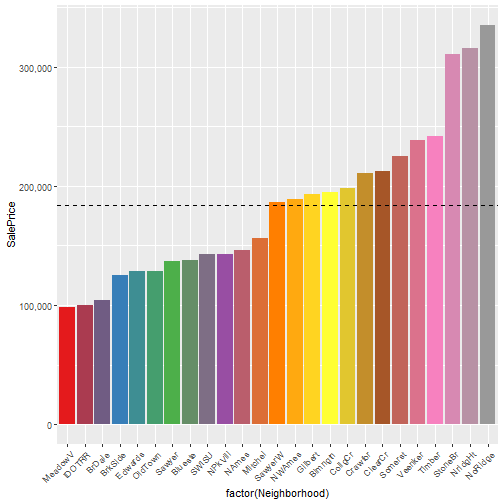

Predicting Housing Prices
========================================================
author: "Jason Wilcox"
date: "Aug 7th 2018"
autosize: true


Housing Prices
========================================================

How to determine what really is the value of your home when there are so many things to consider
- Size
- Neighborhood
- Quality
- How new
- Plus many many more


Importance of Understanding
========================================================
* Find out house traits that have the most impact on value
* Predict accurately the true sale price
* Help homeowners find the best ways to improve their house value
* Buyers can determine the "true" value of the house and know if its a good deal or not


Data and Initial Thoughts
========================================================
* Data was taken from the kaggle competition: https://www.kaggle.com/c/house-prices-advanced-regression-techniques
* Information for all the variables can be found witht he data, since some have truncated names
* Initially, I figured neighborhood, house size, age, and size of property would be the largest factors for determining the value of a house.


Basic Housing Info
========================================================
Housing prices has a large range of values with the mean price around $163,000


```
   Min. 1st Qu.  Median    Mean 3rd Qu.    Max.    NA's 
  34900  129925  163000  180933  214000  755000    1459 
```

* What are some of the most important qualities a home has that determine these values?

Correlation
=========================================================
Using a correlation plot, I was able to quickly see the most important variables for determining SalePrice


* OverallQual, totalSqFt, GrLivArea, ExterQual, and KitchenQual were the top 5 traits
* Shows several points which have "similar" values (GarageCars & GarageArea), suggesting they are colinear
* I used this to build my model and refine the most important traits


OverallQuality vs Price
=========================================================

***
Houses had a given quality rating, 1-10
* Significant increase around 7~8 rating
* Entails the entire quality of the house "Overall material and finish quality"
* Suggests that building a house with quality materials and craftsmanship is much better than going with cheap labor and materials


Size vs Price
=========================================================


***
As expected, there is a very strong correlation between the size of a house and its price.
* Not all large houses sell for more money, as can be seen with several of the points that fall below the blue line
* A good way to add value to your home is to add square footage!

Neighborhood vs Price
=========================================================

***
Some neighborhoods have significantly larger average house values
* If selling your house, you have an idea what the value should be based on similar houses in the neighborhood
* If buying, you can see which neighborhoods have high and low valued houses
* With more data, you could see how the proximity to a school, fire station, hospital, etc effects value

Neighborhood vs Quality
=========================================================

***

Neighborhoods compared by house size
* Similar pattern to that of when arranged by price, though some like SWISU stand out, showing that houses in that neighborhood are larger than other similarly valued houses in other neighborhoods

Neighborhood  vs Age
=========================================================

*** 

Comparing using age of the house shows the opposite
* Older houses tend to have lower values but not always. 
* Crawford neighborhood appears to have houses on average, about 75 years old but is near the top 3rd of the group for value.

Predicting Values
========================================================
I will be using a linear regression model to predict housing prices. Using the accuracy() command, I'll be checking the different model's ability to predict the values that we already know and compare with root mean squared error (RMSE) and mean average percent error (MAPE)


```r
round(accuracy(prediction, trueValues), 3)
```

```
            ME    RMSE      MAE    MPE  MAPE
Test set 0.003 20975.7 14563.54 -0.546 8.749
```

Using The Model
========================================================
* The model is rough and can only give people and idea, but with better engineering and more data, it could help people all over
* A seller that is struggling on the market could use this information to see how and what they could try to improve on their house to help it sell without dropping the value and may actually allow them to increase the asking price

***

* A builder could look at this and make better plans for how to build the house. Finding contractors that use high quality materials and do a great job.


